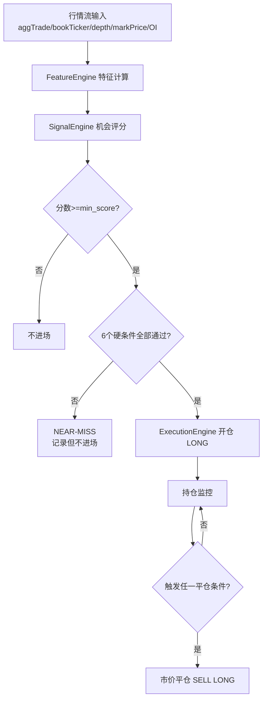

# Binance 合约高频伏击系统：开仓与平仓逻辑说明

更新时间：2026-07-09

## 1. 文档目的

本文档用于完整说明当前系统在实盘模式下的开仓与平仓决策逻辑，包含：

- 特征计算来源
- 开仓评分与硬条件
- 平仓触发条件
- 关键参数与风控关系
- 已删除的旧逻辑与当前策略哲学

---

## 2. 策略总览

当前策略是纯信号驱动做多策略，核心思想：

- 入场阶段：严筛（评分 + 6个硬条件）
- 持仓阶段：让利润奔跑，不设固定止盈止损
- 出场阶段：仅在动量/流动性恶化时退出

执行方向：

- 仅做多（LONG）
- Binance U本位合约
- Hedge Mode
- 下单时显式使用 `positionSide=LONG`

---

## 3. 决策流程图

---

## 4. 开仓逻辑

### 4.1 开仓前置条件

每次特征更新时，系统会先检查：

1. 当前 symbol 是否已有持仓
2. 信号引擎是否返回有效信号

只有满足以下条件才允许开仓：

- signal 存在
- signal.is_valid 为 True
- 该 symbol 当前不在持仓中

---

### 4.2 机会评分（Opportunity Score）

评分由 7 个子项加权并减去风险罚分：

score = oi*0.25 + taker*0.20 + book*0.20 + breakout*0.15 + volume*0.10 + funding*0.05 + spread*0.05 - risk_penalty

#### 4.2.1 OI 分

- oi_change_5m > 2%：+20
- oi_change_5m > 4%：再 +20
- oi_change_15m > 6%：+30
- oi_change_15m > 10%：再 +10
- 若 5m 价格已涨 >4% 且 15m OI >10%：-30（防追高）

#### 4.2.2 主动买入分（taker）

- taker_buy_ratio_10s > 60%：+25
- taker_buy_ratio_30s > 58%：+25
- taker_buy_ratio_60s > 55%：+20
- 若 taker_buy_ratio_10s > 70% 但价格几乎不动：-30（疑似诱多）

#### 4.2.3 盘口分（book）

- book_imbalance_03 > 1.3：+20
- book_imbalance_03 > 1.8：再 +10
- bid_depth_03_change > 40%：+25
- bid_depth_collapsed：-50

#### 4.2.4 突破分（breakout）

- 突破30秒高点：+20
- 突破1分钟高点：+10
- 突破3分钟高点：+5

#### 4.2.5 成交量分（volume）

- volume_ratio_5m > 2.0：+50
- >1.5：+30
- >1.2：+15

#### 4.2.6 资金费率分（funding）

- |funding_rate| < 0.0003：+50
- funding_rate < -0.0003：+20

#### 4.2.7 点差分（spread）

- spread_rate < 0.0005：+50
- spread_rate < 0.0010：+30
- spread_rate < 0.0020：+10

#### 4.2.8 风险罚分（risk_penalty）

- funding_rate > 0.0005：+20罚分
- spread_rate > 0.0020：+30罚分
- spread_abnormal：+20罚分
- price_change_5m > 5%：+30罚分
- price_change_15m > 10%：+50罚分
- 高taker但价格不动：+40罚分
- bid_depth_collapsed：+50罚分

额外规则：

- 同一 symbol 连续失败次数 >=3 次时，再加 fail_penalty=100

最终分数：

- final_score = total_score - fail_penalty

入场最低分阈值：

- min_score = 15

---

### 4.3 六个硬条件（全部必须满足）

当 final_score >= min_score 后，仍需全部通过以下硬条件：

1. book_imbalance >= 1.50
2. bid_depth_03_change >= 0.30
3. spread_rate <= 0.0020
4. funding_rate <= 0.0005
5. price_change_10s > 0.0005
6. price_breaks_30s_high = True

只要有一个不通过，即不进场。

---

### 4.4 开仓执行细节

- 资金分配：equity * first_entry_pct（当前 0.50）
- 价格：市价单成交均价（avgPrice），若无则用当前特征价
- 模式：live 模式真实下单，paper 模式模拟
- 订单方向：BUY + LONG
- 数量精度：按交易对步长向下取整

---

## 5. 持仓更新逻辑

每次特征刷新时，系统对持仓执行：

1. 更新 mark_price
2. 更新 unrealized_pnl_pct
3. 更新 max_profit_pct / max_loss_pct
4. 调用 should_exit 判断是否平仓

---

## 6. 平仓逻辑（纯信号驱动）

当前平仓仅由以下 4 条触发，不包含固定止盈、固定止损、时间止损。

### 6.1 BOOK_IMBALANCE_REVERSED

触发条件：

- 持仓时长 > 30 秒
- book_imbalance_03 < 1.0

意义：买压明显衰退或反转，入场逻辑对立面成立。

### 6.2 TAKER_BUY_WEAKENED

触发条件：

- 持仓时长 > 30 秒
- taker_buy_ratio_10s < 0.40

意义：主动买入明显转弱，短线动量衰减。

### 6.3 BID_DEPTH_DISAPPEARED

触发条件：

- 当前 bid_depth_03 < 入场时 bid_depth_03 的 30%

意义：买盘深度崩塌，可能大单撤单或被快速吃掉。

### 6.4 SPREAD_ABNORMAL

触发条件：

- spread_abnormal=True

意义：流动性恶化，成交滑点风险提升。

---

## 7. 已删除的历史平仓机制

以下机制已从当前执行逻辑中移除：

- TAKE_PROFIT（固定止盈）
- HARD_STOP（固定止损）
- TIME_STOP（时间止损）
- MAX_HOLDING_TIME（最长持仓强平）
- TRAILING_TAKE_PROFIT（浮盈回撤止盈）

这使策略从“价格阈值驱动”转为“市场状态驱动”。

---

## 8. 关键参数（当前）

来自 config.yaml：

- strategy.min_score = 15
- strategy.book_imbalance_03_min = 1.50
- strategy.bid_depth_03_change_min = 0.30
- strategy.spread_rate_max = 0.0020
- execution.first_entry_pct = 0.50
- binance.live_leverage = 10

代码侧关键常量：

- 平仓保护期（BI/taker）= 30秒

---

## 9. 策略哲学与实盘解释

该策略并非追求高胜率，而是追求正期望：

- 入场时尽量只进“高动量 + 真突破 + 真买盘”
- 出场时仅在动量或流动性真实转坏时退出
- 允许盈利单长时间持有，避免固定止盈过早截断利润

简述：

- 以严格入场提高质量
- 以信号出场保护趋势
- 让盈利交易有机会跑出大R

---

## 10. 代码锚点（便于后续核对）

- SignalEngine 评分与硬条件：services/signal_engine.py
- ExecutionEngine 进场/平仓：services/execution.py
- 特征计算与价格突破修复：services/feature_engine.py
- 参数定义：core/config.py

---

## 11. 当前版本结论

当前系统已进入“纯信号平仓”形态，开仓条件严格、平仓规则简化，核心优化点是将早期误出场保护期提升至30秒，目标是减少手续费侵蚀并提升持仓利润扩展能力。
